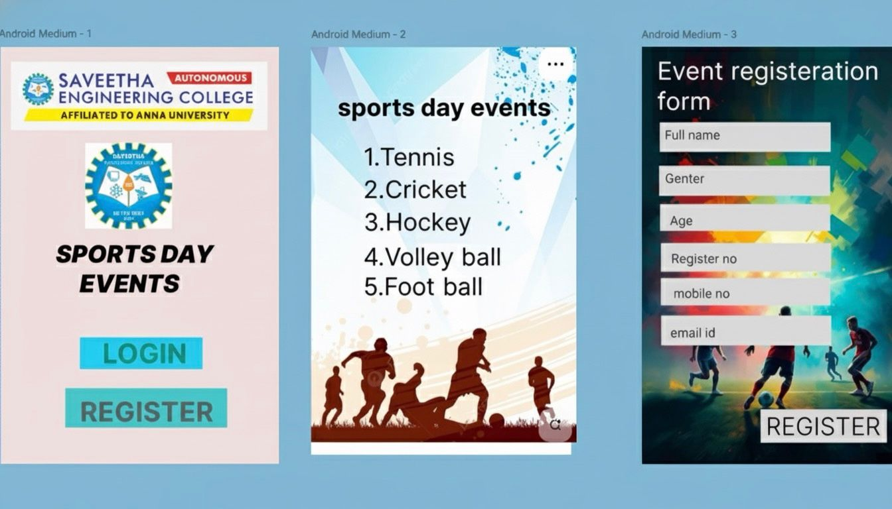

# Ex09 Event Registration Web Application
## Date:16-11-25

## AIM:
To design, develop and deploy a web application for event registration.

## DESIGN STEPS:

### Step 1:
Create a new frame.

### Step 2:
Select any one preset size of your choice.

### Step 3:
Select the shapes you need.

### Step 4:
Import images as needed.

### Step 5:
Create pages based on your need and link them.

### Step 6:

Validate the HTML and CSS code.

### Step 6:

Publish the website in the given URL.

## DESIGN TOOL:
Figma

## CODE:
```
PAGE 1 – Home (Sports Day Events):

<div style="width: 142px; height: 264px; position: relative; background: white;">
  
  
  
  <div style="left:20px; top:160px; position:absolute; color:black; font-size:16px; font-family:Arial; font-weight:700;">SPORTS DAY<br/>EVENTS</div>
  <div style="width:90px; height:22px; left:25px; top:200px; position:absolute; background:#35C6EC;"></div>
  <div style="left:50px; top:204px; position:absolute; color:white; font-size:14px; font-family:Arial;">LOGIN</div>
  <div style="width:90px; height:22px; left:25px; top:230px; position:absolute; background:#35C6EC;"></div>
  <div style="left:45px; top:234px; position:absolute; color:white; font-size:14px; font-family:Arial;">REGISTER</div>
</div>

PAGE 2 – Events List:

<div style="width:142px; height:264px; position:relative; background:white;">
  
  <div style="left:20px; top:20px; position:absolute; color:black; font-size:16px; font-family:Arial; font-weight:700;">sports day events</div>
  <div style="left:20px; top:60px; position:absolute; color:black; font-size:14px; font-family:Arial;">
    1. Tennis<br/>
    2. Cricket<br/>
    3. Hockey<br/>
    4. Volley ball<br/>
    5. Foot ball
  </div>
  
</div>


PAGE 3 – Registration Form:

<div style="width:142px; height:264px; position:relative; background:white;">
  
  <div style="left:10px; top:20px; position:absolute; color:white; font-size:18px; font-family:Arial;">Event registeration<br/>form</div>

  <input style="width:120px; height:20px; left:10px; top:70px; position:absolute; background:#D9D9D9; border:none; padding-left:4px;" placeholder="Full name">
  <input style="width:120px; height:20px; left:10px; top:100px; position:absolute; background:#D9D9D9; border:none; padding-left:4px;" placeholder="Gender">
  <input style="width:120px; height:20px; left:10px; top:130px; position:absolute; background:#D9D9D9; border:none; padding-left:4px;" placeholder="Age">
  <input style="width:120px; height:20px; left:10px; top:160px; position:absolute; background:#D9D9D9; border:none; padding-left:4px;" placeholder="Register no">
  <input style="width:120px; height:20px; left:10px; top:190px; position:absolute; background:#D9D9D9; border:none; padding-left:4px;" placeholder="Mobile no">
  <input style="width:120px; height:20px; left:10px; top:220px; position:absolute; background:#D9D9D9; border:none; padding-left:4px;" placeholder="Email id">

  <div style="width:80px; height:24px; left:30px; top:248px; position:absolute; background:white; border:1px solid black;"></div>
  <div style="left:42px; top:252px; position:absolute; color:black; font-size:14px; font-family:Arial;">REGISTER</div>
</div>


```

## OUTPUT:


## RESULT:
The program to design, develop and deploy a web application for event registration is completed successfully.
